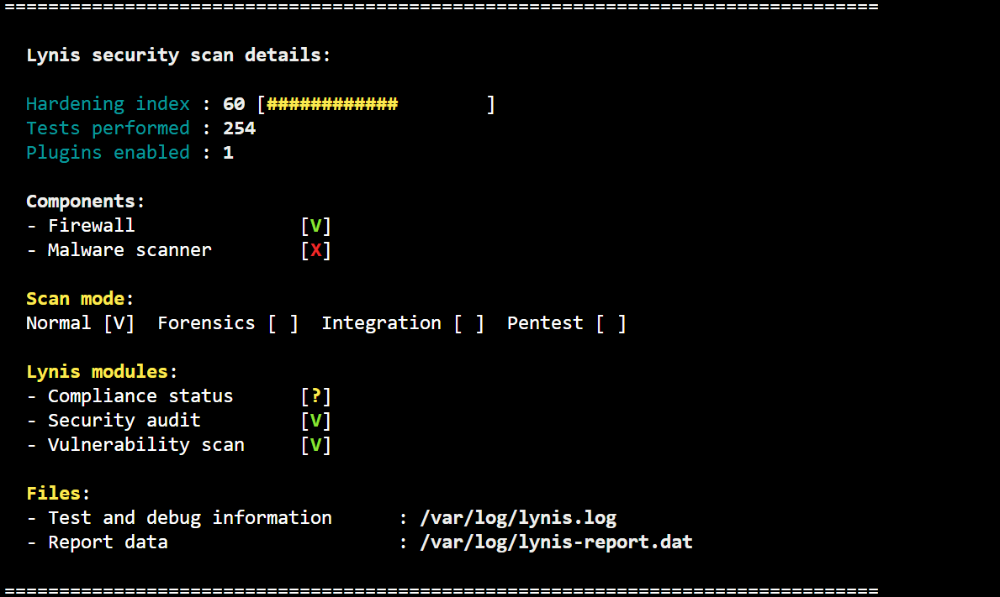
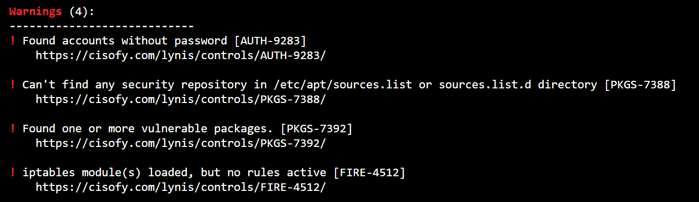
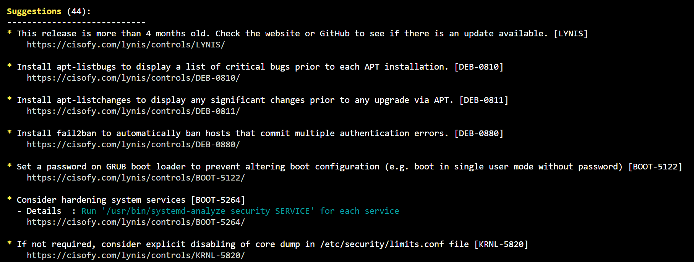

# Governance, Risk, and Compliance (GRC) Lab Project: Linux System Hardening

## Executive Summary
This project documents a comprehensive Governance, Risk, and Compliance (GRC) lab focused on securing a Linux system. Using **Lynis** as the primary audit tool, 44 findings were identified and addressed through mitigation efforts mapped to **NIST 800-171** controls and **CIS Benchmarks**.  

Key mitigations included strengthening password policies, configuring firewalls, securing the GRUB bootloader, disabling unused protocols (SCTP), and implementing patch management tools like apt-show-versions. Evidence of fixes is provided through configuration files, terminal outputs, and verification logs.

---

## Objectives
- Identify and analyze system vulnerabilities using **Lynis**.
- Map findings to **NIST 800-171** controls and **CIS Benchmarks**.
- Implement mitigation strategies for each finding to reduce risk.
- Document the process with evidence for audit readiness.

---

## Tools and Frameworks
- **Audit Tools**: Lynis, apt-listbugs, apt-show-versions
- **Frameworks**: NIST 800-171 (IA-5, AC-6, SC-7, SI-2), CIS Benchmarks

---

## 📋 Key Findings and Mitigation Summary

| Finding                     | Description                                     | NIST Control | Status      |
|-----------------------------|-------------------------------------------------|--------------|-------------|
| Account Without Password     | User account missing password                  | IA-5         | Resolved    |
| Security Repository Missing  | Missing apt security repository                | SI-2         | Resolved    |
| Firewall Ruleset             | No active firewall configuration               | SC-7         | In Progress |
| GRUB Password                | GRUB lacks password protection                 | AC-3, AC-6   | In Progress |
| SCTP Protocol                | Enabled but unused, increasing attack surface  | AC-6, SC-7   | In Progress |
| Password Policy Enforcement  | Weak PAM, no min/max password age set          | IA-5         | In Progress |
| Patch Management Tracking    | apt-show-versions installed and configured     | SI-2, CM-6   | Resolved    |
| **Total Findings**           | 44 identified with Lynis                       | Mixed        | Partial     |

---

## Screenshots
### Environment - Microsoft Azure Virtual Machine Deployment

### Lynis Scan – Initial Findings

- Above is the initial security scan that Lynis produced
- As we can see, there is a 60 hardness score, which is out of 100

- Above, we find that Lynis produces warnings
- Warnings are critical actions that need to be resolved

- The most exciting part about this project is above
- Lynis produces suggestions in its reports to aid in system hardening
- What was most exciting for me was making decisions myself that I felt needed to be dealt with to make sure the system is hardened
- For this project, I am currently working through all 44 suggestions and deciding which actions need to be taken

---

## Security Controls Applied
- **IA-5 (Authenticator Management)**: Enforced strong password policies, PAM configuration, password complexity, and history settings.
- **AC-6 (Least Privilege)**: Disabled unused protocols (SCTP), secured GRUB, configured default umask for files and directories.
- **SC-7 (Boundary Protection)**: Configured UFW/iptables firewall rules, ensuring proper inbound and outbound traffic restrictions.
- **SI-2 (Flaw Remediation)**: Installed apt-listbugs and apt-show-versions for proactive patch management.

---

## Project Outcome
- Enhanced system security posture by addressing critical vulnerabilities.
- Demonstrated expertise in **GRC principles**, **Linux hardening**, and **NIST 800-171** compliance.
- Provided clear documentation and evidence suitable for audit purposes and portfolio showcase.

---
